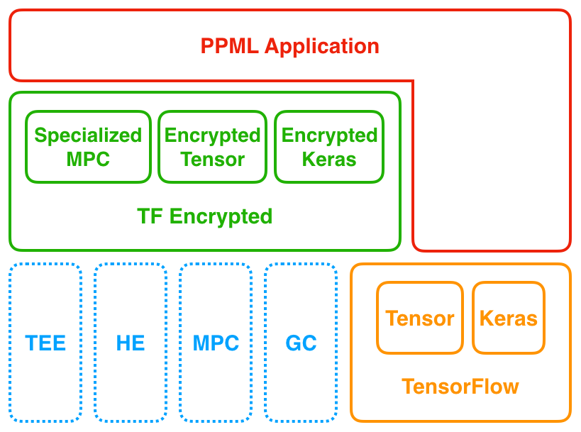
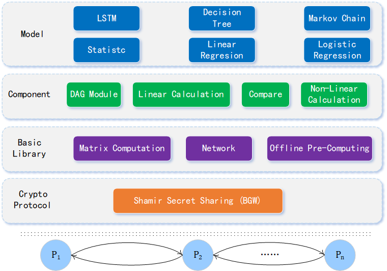

# TF-Encrypted

**Underlying Protocols:** ABY3, SecureNN, Pond

## Strength

- Providing high-level language interfaces. Non-expert users can utilize the framework with python language and corresponding APIs.
- Supporting multiple privacy-preserving paradigms, including Federate learning and Multi-party Learning.

## Weakness

- Only applicable in two or three parties scenarios.
- Cannot support complex models (e.g., LSTM).
- Cannot add or remove training parties dynamically.

# SecMML

**Underlying Protocol:** BGW

## Strength

- Supporting an arbitrary number of data owners who participate in the collaborative training.
- Enabling users to conduct multiple intelligent models, such as Long-Short Term Memory (LSTM), through simply configuring a data flow graph.
- Adding or removing training parties dynamically.
- No dependence on any external library and can be easily deployed.
- Promising efficiency.

## Summary

|                                   | Party Number | Data Flow Graph | Dynamically add/remove parties | Independent of external libraries | Complex Models (e.g. LSTM) |
| --------------------------------- | --------------------------------- | ------------------------------------ | --------------------------------------------------- | ------------------------------------------------------ | ----------------------------------------------- |
| SecMML                            | 3+                                | Yes                                  | Yes                                                 | Yes                                                    | Yes                                             |
| TF-Encrypted | 2 or 3                            | Yes                                  | No                                                  | No                                                     | Currently No                                    |

