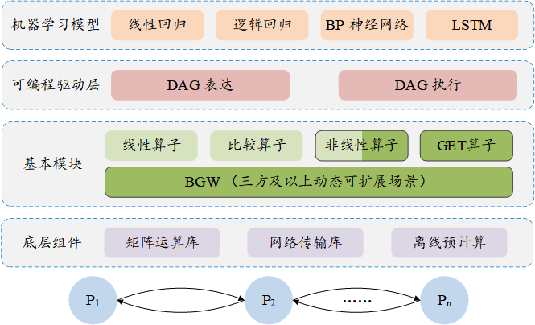
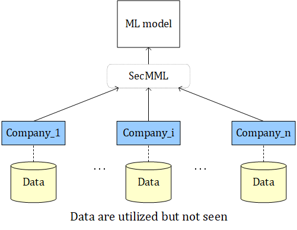

# SecMML

## 介绍
SecMML(鹊桥)是FudanMPL(<u>M</u>ulti-<u>P</u>arty Computation + Machine <u>L</u>earning)的一个分支，是用于训练机器学习模型的高效可扩展的安全多方计算（MPC）框架，基于BGW协议实现。此框架可以应用到三个及以上参与方联合训练的场景中。目前，SecMML能够支持几种当前流行的机器学习模型，包括线性回归模型，逻辑回归模型，BP神经网络和LSTM神经网络模型。



## Introduction
  SecMML (Queqiao), a branch of FudanMPL (<u>M</u>ulti-<u>P</u>arty Computation + Machine <u>L</u>earning) , is a scalable and efficient MPC framework for training machine learning models based on BGW protocol.
It has the generality to be extended in the application scenarios of three+ parties in both semi-honest and malicious (todo) settings .
Currently, SecMML is able to support several popular machine learning models, including linear regression, logistic regression, BP neural networks and LSTM neural networks.

## Application scenario

There are two practical situations as follow:

1. As the following figure shows, several companies hold their own data sets respectively and want to train a better model on their union data sets wihtout sharing the plaintext of their datasets. At first, they share their data to other parties in a secret sharing manner. In this way, each party has a share of the entire data set. Then, as a party, each company trains the model collaboratively.  Our framework is extensible to support arbitrary number of participants (three+) to train models on the entire data set composed of the data they hold. 

    

2. There are a large number of individual data owners and they do not want their private data to be known by others. Internet companies want to make use of these distributed data to acquire better models. These companies may first specify several servers to perform the computation and these servers must be independent of each other. All data owners then send their data to these servers in secret sharing manner. The servers collaboratively train the model with these data and the trained model is finally revealed to the data owners. The scalability of the framework is that it can support any number of data owners, and any number of servers can be selected as computing parties. 

## Repository Structure
* `constant.json`: All global parameters are restored here. For more detailed information, annotations are available in config/Config.hpp

* `Test/` : All tests can be found here. Make sure that relative path of file names in constant.json have been changed.

* `core/`: Core libraries in MPL. The fundamental matrix lib, math operator lib and Player lib.  Some math computations are compiled as libraries (libcore_lib.so).

* `machine_learning/`: Machine learning algorithms: neural networks, linear regression and logistic regression.

* `datesets/mnist/`: Training dataset.

* `util/`: Data IO and network IO package. The network is implemented using socket, compatible on both Windows and Ubuntu.

* `Constant.h`: Some constants and general functions in SecMML. Note that, for windows users, the macro `UNIX_PLATFORM` should be defined to use the `winsocket` library.

* `CMakeLists.txt`: Define the compile rule for the project. Note that, for windows users, the `target_link_libraries(SMMLF ws2_32)` shall be uncommented.

* `python_lib/`: Machine learning algorithms built from interfaces for Python: neural networks, linear regression and logistic regression.

* `queqiao_wrapper.cpp`: The topmost wrapper code that defines the interfaces for Python.

* `*_wrapper.cpp`: Wrapper code for corresponding classes.

## Running

Here take training a linear regression model among three parties as an example

* Clone the SecMML git repository by running:

  `git clone https://github.com/FudanMPL/SecMML.git`

* Set the number of parties to 3 (in `Constant.h`. Note that, M can be any arbitrary number >= 3):
  
  `#define M 3`

* Specify the platform:
    - if Ubuntu  (in `Constant.h`)
    
            `#ifndef UNIX_PLATFORM`
    
            `#define UNIX_PLATFORM`
            
            `#endif`
    - if Windows (in `CMakeLists.txt`):

            Add `target_link_libraries(SMMLF ws2_32)` to the file.

* Choose the machine learning model (`main.cpp`):
    - Linear Regression Model: bp->linear_graph();
    - Logistic Regression Model: bp->logistic_graph();
    - Three-layer Model: bp->graph();
    - LSTM: lstm->graph();
    
* Compile the executable file:
    - `cd SecMML`
    - `cmake .`
    - `make`

* Start three processes and input the party index, respectively:
    - `./MPL`
    - `Please enter party index:`
    - Enter 0,1,...,M-1 for each process in order.

## Running in Python

Here take training a linear regression model among three parties as an example

* Clone the SecMML git repository by running:

  `git clone https://github.com/FudanMPL/SecMML.git`

* Set the number of parties to 3 (in `constant.json`. Note that, M can be any arbitrary number >= 3):
  
  "M": 3

* Install dependency:

  `pip install pybind11[global]`

* Compile the dynamic library:
    - `cd SecMML`
    - `cmake -Dqueqiao=ON .`
    - `make`

* Choose the machine learning model (`queqiao.py`):
    - Linear Regression Model: model = linear_regression.graph(io)
    - Logistic Regression Model: model = logistic_regression.graph(io)
    - Three-layer Model: model = bp_nn.graph(io)
    - LSTM: model = lstm_nn.graph(io)

* Start three processes and input the party index, respectively:
    - `python3 queqiao.py`
    - `Please enter party index:`
    - Enter 0,1,...,M-1 for each process in order.

* Support IntelliSense features of IDE:
    - Generate stub file for queqiao:
      ```
      pip install mypy 
      stubgen -m queqiao -o ./
      ```
    - Find the include path of pybind11: 
      ```
      python3 -m pybind11 --includes
      ```


## Help

Any question, please contact 20212010009@fudan.edu.cn.

## Contributor

**Faculty**: Prof. Weili Han

**Students**: Haoqi Wu (Graduate Student), Zifeng Jiang (Graduate Student), Wenqiang Ruan (Ph.D Candidate), Shuyu Chen (Graduate Student), Xinyu Tu (Graduate Student), Zhexuan Wang (Graduate Student), Lushan Song (Ph.D Candidate), Dingyi Tang (Post Graduate Student)

## Related Projects

* Secure Quantized Training for Deep Learning: https://arxiv.org/pdf/2107.00501  
    - code: https://github.com/data61/MP-SPDZ


